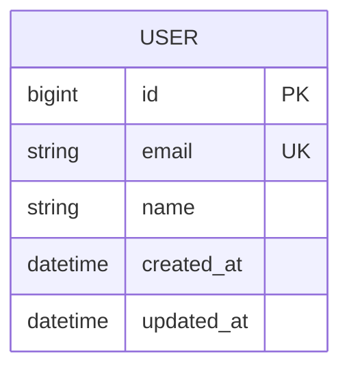

# ERD 문서

## 문서 정보

| 항목 | 내용 |
| --- | --- |
| 프로젝트명 |  |
| 작성자 |  |
| 최초 작성일 |  |
| 마지막 수정일 |  |
| DBMS |  |
| 관련 링크 |  |

## 개요

이 문서는 프로젝트의 데이터 구조, 엔티티 관계, 주요 제약 조건을 정의한다.

## ERD

## 엔티티 목록

| 엔티티 | 설명 | 비고 |
| --- | --- | --- |
| USER | 사용자 정보 | 예시 엔티티 |

## 엔티티 상세

### USER

| 컬럼명 | 타입 | Null | Key | Default | 설명 |
| --- | --- | --- | --- | --- | --- |
| id | bigint | N | PK |  | 사용자 ID |
| email | varchar(255) | N | UK |  | 이메일 |
| name | varchar(100) | N |  |  | 이름 |
| created_at | datetime | N |  | CURRENT_TIMESTAMP | 생성 일시 |
| updated_at | datetime | N |  | CURRENT_TIMESTAMP | 수정 일시 |

## 관계 정의

| 관계 | 카디널리티 | 설명 |
| --- | --- | --- |
|  | 1:N / N:M / 1:1 |  |

## 인덱스 및 제약 조건

| 대상 | 유형 | 컬럼 | 설명 |
| --- | --- | --- | --- |
| USER | UNIQUE | email | 이메일 중복 방지 |

## 데이터 정책

| 항목 | 정책 |
| --- | --- |
| 삭제 정책 | Soft delete / Hard delete 여부 작성 |
| 감사 컬럼 | created_at, updated_at 등 |
| 개인정보 | 암호화 또는 마스킹 대상 작성 |

## 미정 사항

| 항목 | 내용 | 담당자 | 상태 |
| --- | --- | --- | --- |
|  |  |  | Open |

## 변경 이력

| 날짜 | 변경 내용 | 작성자 |
| --- | --- | --- |
|  | 초안 작성 |  |
