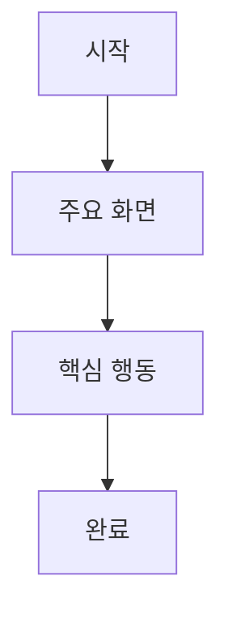

# PRD 문서

## 문서 정보

| 항목 | 내용 |
| --- | --- |
| 프로젝트명 |  |
| 제품/기능명 |  |
| 작성자 |  |
| 최초 작성일 |  |
| 마지막 수정일 |  |
| 상태 | Draft / Review / Approved |
| 관련 링크 |  |

## 1. 개요

### 배경

### 문제 정의

### 목표

| 목표 | 설명 | 성공 기준 |
| --- | --- | --- |
|  |  |  |

### 제외 범위

- 

## 2. 사용자 및 사용 시나리오

### 대상 사용자

| 사용자 유형 | 설명 | 주요 니즈 |
| --- | --- | --- |
|  |  |  |

### 사용자 시나리오

| 시나리오 | 사용자 행동 | 기대 결과 |
| --- | --- | --- |
|  |  |  |

## 3. 요구사항

### 기능 요구사항

| ID | 요구사항 | 우선순위 | 설명 | 수용 기준 |
| --- | --- | --- | --- | --- |
| FR-001 |  | Must / Should / Could |  |  |

### 비기능 요구사항

| ID | 분류 | 요구사항 | 기준 |
| --- | --- | --- | --- |
| NFR-001 | 성능 |  |  |

## 4. 화면 및 플로우

### 사용자 플로우

### 화면 목록

| 화면 | 목적 | 주요 요소 | 비고 |
| --- | --- | --- | --- |
|  |  |  |  |

## 5. 데이터 및 정책

| 항목 | 내용 |
| --- | --- |
| 주요 데이터 |  |
| 권한 정책 |  |
| 보관/삭제 정책 |  |
| 예외 처리 |  |

## 6. 성공 지표

| 지표 | 측정 방식 | 목표값 |
| --- | --- | --- |
|  |  |  |

## 7. 일정 및 마일스톤

| 마일스톤 | 목표일 | 산출물 | 상태 |
| --- | --- | --- | --- |
|  |  |  | 예정 |

## 8. 리스크 및 의존성

| 항목 | 유형 | 영향도 | 대응 방안 |
| --- | --- | --- | --- |
|  | 리스크 / 의존성 | High / Medium / Low |  |

## 9. 미정 사항

| 질문 | 배경 | 담당자 | 상태 |
| --- | --- | --- | --- |
|  |  |  | Open |

## 변경 이력

| 날짜 | 변경 내용 | 작성자 |
| --- | --- | --- |
|  | 초안 작성 |  |
